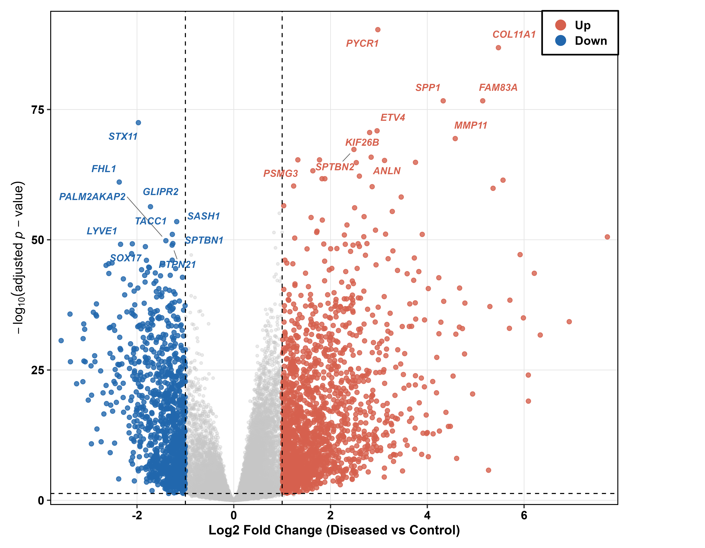
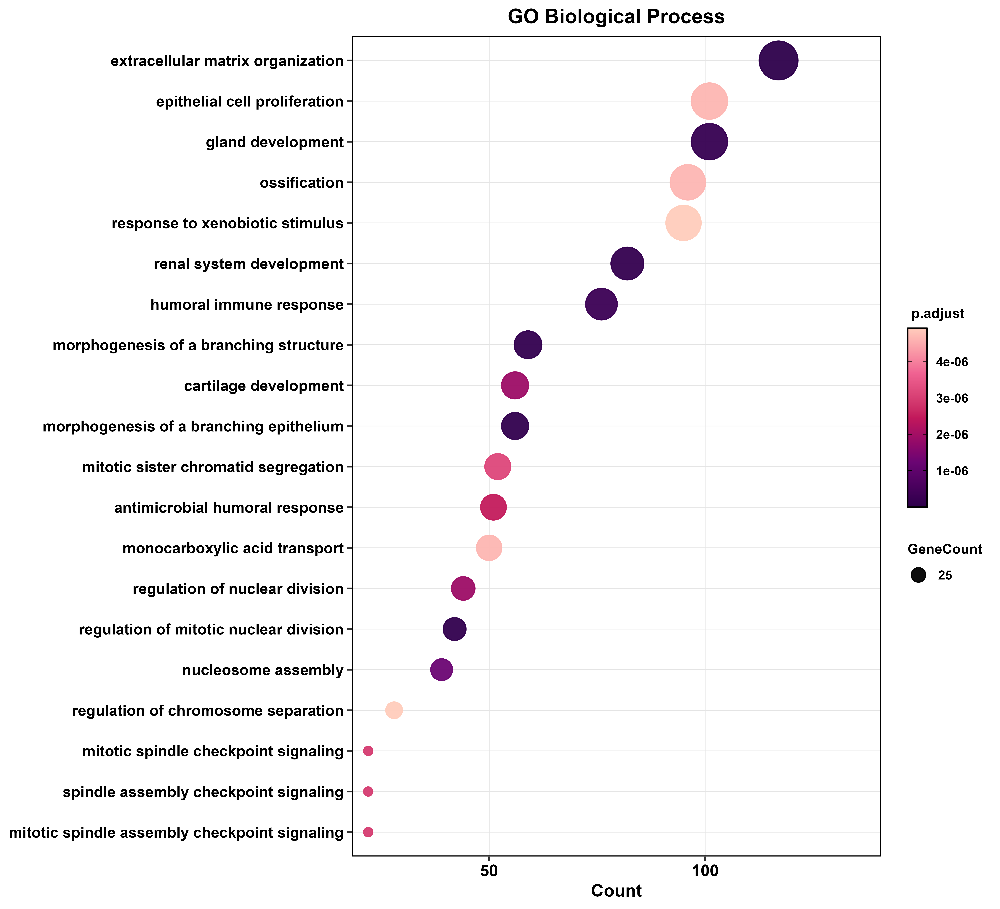

# Comprehensive Meta-Analytical Framework for Cross-Platform Bulk RNA-Sequencing Integration in Pulmonary Neoplasia

[](https://www.r-project.org/)
[](https://bioconductor.org/packages/release/bioc/html/DESeq2.html)
[-green.svg)](https://bioconductor.org/packages/release/bioc/html/sva.html)
[](https://bioconductor.org/packages/release/bioc/html/clusterProfiler.html)
[](https://opensource.org/licenses/MIT)

## Executive Summary
This repository contains the complete, reproducible computational pipeline utilized for a highly integrated, cross-platform transcriptomic meta-analysis of human pulmonary neoplasia. While massive repositories of high-throughput sequencing data exist, individual studies frequently lack the statistical power necessary to derive universal, platform-agnostic genomic signatures. Merging multiple independent cohorts mitigates this limitation but inherently introduces profound technical batch effects driven by disparate sequencing chemistries and institutional protocols. 

This project establishes a rigorous bioinformatics architecture that deploys an empirical Bayes statistical framework (`ComBat-seq`) to harmonize raw count matrices spanning three distinct generations of Illumina sequencing hardware. Subsequent negative binomial generalized linear modeling (`DESeq2`) isolates the core protein-coding gene expression signatures driving lung tumorigenesis. The resulting data provides high-confidence translational targets, deeply annotated through comprehensive systems biology and functional pathway enrichment algorithms.

## Biological Background and Rationale
Lung cancer remains a dominant etiology of global oncology-related mortality. The disease is characterized by extreme histological and molecular heterogeneity, predominantly stratified into Lung Adenocarcinoma (LUAD) and Lung Squamous Cell Carcinoma (LUSC). Identifying robust, universal diagnostic biomarkers and viable therapeutic targets requires the interrogation of massive, diverse datasets. 

While individual Gene Expression Omnibus (GEO) studies provide valuable, localized insights into tumor microenvironments, their limited sample sizes often constrain the broader applicability of their findings. Integrative meta-analysis resolves the issue of statistical underpowering. However, combining raw RNA-sequencing data from different laboratories requires aggressive mathematical correction for non-biological variance factors. These confounding variables include variations in poly-A capture efficiency, RNA degradation rates (RIN scores), flow cell architecture, and bioinformatic counting pipelines. This pipeline is specifically engineered to resolve these multi-collinearity issues, ensuring that the isolated Differentially Expressed Genes (DEGs) represent true oncogenic pathology rather than artefactual technical noise.

## Data Provenance and Clinical Curation
Raw count arrays and associated clinical meta-information were programmatically retrieved from the NCBI GEO repository. The integration strategy was designed to encompass a spectrum of sequencing depths and rigorous clinical pairings to maximize signal-to-noise ratios.

| Study Accession | Platform and Chemistry | Target Strategy | Analyzed Matrix Size | Clinical Design and Justification |
| :--- | :--- | :--- | :--- | :--- |
| **[GSE283245](https://www.ncbi.nlm.nih.gov/geo/query/acc.cgi?acc=GSE283245)** | Illumina NovaSeq 6000 (GPL24676) | Poly-A mRNA | Full Cohort | Tumor vs. Normal. Provides a modern, ultra-high-depth baseline for differential expression. |
| **[GSE81089](https://www.ncbi.nlm.nih.gov/geo/query/acc.cgi?acc=GSE81089)** | Illumina HiSeq 2500 (GPL16791) | Poly-A mRNA | 38 Samples | 19 Matched Patient Pairs. Subsetting to matched adjacent normal/tumor tissues neutralizes host genomic background noise. |
| **[GSE159857](https://www.ncbi.nlm.nih.gov/geo/query/acc.cgi?acc=GSE159857)** | Illumina NextSeq 500 (GPL18573) | Poly-A mRNA | 58 Samples | LUAD and LUSC Paired. Broadens the applicability of the core gene signature across major histological subtypes. |

## Methodological Framework and Algorithmic Design

The entire analytical workflow is modularized within the master script `R_script/lung_bulk_rnaseq.R`, ensuring strict computational reproducibility.

### 1. Matrix Harmonization and Genomic Annotation
* **Identifier Translation:** Raw transcript identifiers frequently utilize versioned Ensembl IDs (e.g., ENSG00000141510.16), which map poorly across different reference genomes. These are computationally parsed, stripped of versioning, and translated to stable NCBI Entrez IDs and HGNC Symbols via `biomaRt` utilizing the `hsapiens_gene_ensembl` database.
* **Duplication Resolution:** Technical discrepancies arising from multiple Ensembl IDs mapping to a single Entrez ID are programmatically resolved. Rather than arbitrarily dropping duplicated rows, the pipeline aggregates and sums the raw integer counts per base Entrez ID, thereby preserving the total library sequencing depth and preventing the loss of low-abundance transcripts.
* **Metadata Alignment:** Clinical meta-data from the distinct studies are homogenized into a single matrix. Independent clinical variables are abstracted into standardized factorial columns: `condition` (control versus diseased) and `batch` (the GEO accession origin).

### 2. Empirical Batch Effect Correction
* **The Variance Problem:** Given the platform heterogeneity (NovaSeq, NextSeq, HiSeq), uncorrected raw count matrices exhibit extreme principal component clustering dominated by GEO accession rather than biological phenotype.
* **ComBat-seq Application:** Traditional ComBat normalizes log-transformed data. However, applying Gaussian-based normalization prior to differential expression violates the core assumptions of negative binomial distribution models. Therefore, `ComBat_seq` (from the `sva` package) is applied directly to the raw merged integers. This utilizes an empirical Bayes framework to regress out the platform-specific technical variance while strictly preserving the discrete nature of the integer count data.

### 3. Differential Expression Modeling via DESeq2
* **Statistical Modeling:** The batch-corrected matrix is subjected to `DESeq2` utilizing the multifactorial design formula `~ batch + condition`. This allows the generalized linear model to account for any residual inter-study variance while extracting the core biological differences.
* **Independent Filtering:** Transcriptomic features exhibiting fewer than 10 reads across fewer than 10 samples are computationally excluded prior to testing. This optimizes memory allocation and significantly improves the statistical power by reducing the penalty of the Benjamini-Hochberg False Discovery Rate (FDR) multiple testing correction.
* **Biotype Masking:** To focus the analysis exclusively on actionable, translational protein targets, a custom Regular Expression (RegEx) mask is applied post-analysis. This systematically filters out non-coding RNAs, pseudogenes, and uncharacterized loci (e.g., LINC, MIR, SNORD, LOC), returning a highly curated matrix of protein-coding DEGs. 
* **Significance Thresholding:** Stringent statistical cutoffs are established at an absolute Log2 Fold Change greater than 1.0 and an adjusted p-value (FDR) of less than 0.05.

### 4. Systems Biology and Pathway Topology
* **Hypergeometric Testing:** Significant protein-coding targets are ported into the `clusterProfiler` environment for hyper-geometric distribution testing.
* **Over-Representation Analysis (ORA):** ORA is performed against the Gene Ontology (Biological Process, Cellular Component, Molecular Function) and KEGG databases. This transitions the analysis from single-gene identifiers to broader functional biochemical networks, mapping the transcriptomic dysregulation to specific oncogenic signaling cascades, metabolic shifts, and structural cellular reorganizations.

## Computational Environment and Reproducibility

To accommodate the memory-intensive operations required for large-scale matrix algebra and generalized linear modeling, this pipeline was engineered and executed within a specialized Linux-based environment (Windows Subsystem for Linux - WSL) hosted on a high-performance ASUS TUF A15 workstation. 

To meet the rigorous standards of academic publishing, all output graphics are programmatically generated as uncompressed, publication-ready 600 DPI TIFF images, alongside standard PNG and SVG formats, utilizing `ggplot2` and the `ComplexHeatmap` architectures. Due to GitHub file size constraints (which restrict commits exceeding 100MB per file), the high-fidelity TIFFs and intermediate `.rds` binary objects have been excluded via the `.gitignore` directive. Executing the master R script will autonomously reconstruct these local directories, perform the variance stabilizing transformations, and regenerate all high-resolution graphical assets.

## Visual Diagnostics and Analytical Highlights

All visual outputs are automatically directed to the `results_LUNG/03_plots/` directory structure upon script completion. Key analytical diagnostics include:

1. **Batch Correction Efficacy (Principal Component Analysis):** A crucial quality control metric demonstrating the mathematical shift from platform-driven clustering (pre-ComBat-seq) to pure phenotype-driven clustering (post-ComBat-seq), validating the integration strategy.
   

2. **Global Expression Shifts (Volcano Plot):** A scatter plot visualizing the magnitude of change against statistical significance. The application of anti-aliased label placement (`ggrepel`) pinpoints the top differentially expressed biological features.
   

3. **Hierarchical Clustering (Z-Score Heatmap):** Z-score standardized heatmaps utilizing Variance Stabilizing Transformed (VST) expression vectors. This focuses on the top 25 up-regulated and top 25 down-regulated genes, demonstrating the robust segregation of the diseased and control phenotypes across the integrated dataset.
   

4. **Pathway Topology and Functional Inference:** Dot plots revealing the primary Gene Ontology (BP, CC, MF) and Kyoto Encyclopedia of Genes and Genomes (KEGG) pathways co-opted by the neoplastic tissues, ranked by gene count and adjusted significance.
   

## Repository Architecture

```text
lung-cancer-rnaseq-analysis/
├── R_script/
│   └── lung_bulk_rnaseq.R                    # Master execution pipeline and mathematical algorithms
├── count_matrix&metadata/
│   ├── LUNG_merged_raw_counts.tsv            # Global uncorrected integer expression matrix
│   ├── LUNG_combined_metadata.csv            # Harmonized study factors and design matrix
│   └── GSE*_metadata.csv                     # Fragmented study-specific clinical data
└── results_LUNG/
    ├── 01_objects/                           # Binaries, dds arrays, and VST matrices (Gitignored)
    ├── 02_tables/                            # Processed DEG tabular data and enrichment statistics
    └── 03_plots/                             # Autogenerated visualization suites (PNG/SVG/TIFF)
